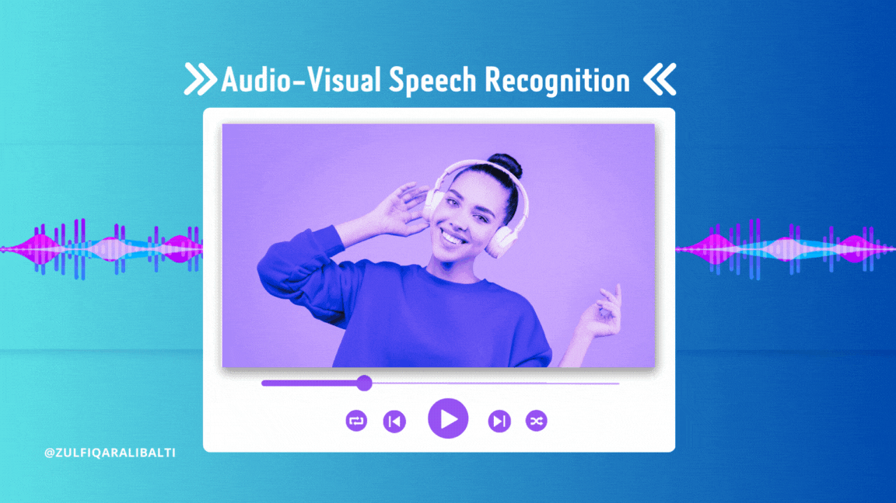

   
    
   

  

    
    
    
    
    
    
  

  <h3 align="center">Video and Audio Transcription Web App</h3>

  

    This web application provides video and audio transcription services using advanced AI models. Users can upload files or provide URLs to obtain transcriptions, making it an essential tool for content creators, researchers, and more.
  

## 📋 <a name="table">Table of Contents</a>

1. 📄 [Introduction](#introduction)
2. ⚙️ [Tech Stack](#tech-stack)
3. 🔋 [Features](#features)
4. 🚀 [Usage](#usage)
5. 🛠️ [Installation](#installation)
6. 📞 [Contact](#contact)

## 🚨 About 

This project is a web application designed to transcribe video and audio files. Users can upload files directly or provide URLs for online content. .

## <a name="introduction">📄 Introduction</a>

This project is a web application designed to transcribe video and audio files. Users can upload files directly or provide URLs for online content. The application leverages powerful AI models to accurately transcribe the content, supporting various languages and models.

## <a name="tech-stack">⚙️ Tech Stack</a>

- Python
- Flask
- Bootstrap
- HTML
- CSS
- PyTorch

## <a name="features">🔋 Features</a>

👉 *File Upload and URL Input*: Users can upload video or audio files or provide URLs for transcription.

👉 *Language and Model Selection*: Supports multiple languages and models for transcription, offering flexibility to the users.

👉 *Real-Time Transcription*: Provides transcription results in real-time, ensuring efficient processing.

👉 *Transcription Status*: Displays the status of the transcription process, keeping users informed.

👉 *Flash Messages*: Uses flash messages to provide feedback on the upload process and transcription status.

## <a name="usage">🚀 Usage</a>

1. *Home Page*: 
    - Upload a file or provide a URL.
    - Select the desired language and model.
    - Click on the "Transcribe" button.

2. *Transcription*: 
    - View the transcription status.
    - Once completed, the transcribed text will be displayed.

3. *Audio Transcription*: 
    - Navigate to the audio transcription page.
    - Upload an audio file, select language and model, and click "Transcribe".

## <a name="installation">🛠️ Installation</a>

1. *Clone the repository*:
    bash
    git clone https://github.com/yourusername/transcription-webapp.git
    

2. *Install dependencies*:
    bash
    pip install -r requirements.txt
    

3. *Run the application*:
    bash
    python app.py
    

4. *Navigate to the application*:
    Open your web browser and go to http://127.0.0.1:5000/.

## <a name="contact">📞 Contact</a>

For any inquiries or issues and requires remaining code of frontend, please contact:

- *Name*: Zulfiqar Ali
- *Email*: zulfiqarcomsats@gmail.com

Enjoy a seamless transcription experience with our web app, where advanced AI meets user-friendly design.
